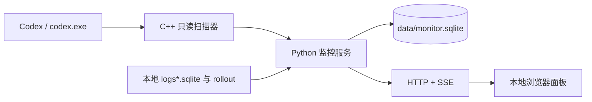

# CodeDowngradedMonitor · Codex 降智雷达

中文 · [English](docs/README.en.md)

> **仅供参考和学习，不具备实用价值。** 本项目只是一次短期的分析研究实验，用来记录和理解本机 Codex 进程中的可见字段；不应把它当作长期运行、稳定监控、生产告警或可靠审计手段。

这是一个观察本机 Codex 请求模型变化的本地工具。背景是：当请求模型和响应对象中的 `model` 不一致时，客户端通常很难留下可复核的本地记录；这个项目尝试把这类现象记录下来，放到一个本地 Web 面板里显示正常、子任务、降级和证据不足的请求。

这个项目是一次**纯 vibecoding 实验**：需求、实现、界面、调试和文档都在与 AI 协作的过程中完成，没有经过正式产品化、安全审计或第三方合规评估。它的定位是一次性分析研究，不是 Codex 的官方组件，也不是服务端审计工具。

相比于社区常用的“鹈鹕测试”，这个项目**不消耗任何 token**：它以只读旁路的方式在本机捕获降智的主要特征之一，不需要发起额外的测试请求；相比于搭代理抓包，它不介入网络链路、不修改任何流量，风险更小。但需要明确的是，它捕获的只是降智的**特征之一**，不代表所有降智都是相同的原理和作用机制——本项目只覆盖“请求模型与服务端实际使用的模型不一致”这一种情况，其余形式的降智不在它的观测范围内。


## 发布前先读

### 条款与责任

工具会读取其他程序的进程内存，以及 Codex 在本机生成的日志和会话文件。这类行为可能违反软件许可、服务条款或组织政策中的**逆向工程、数据提取、自动化访问和本地数据处理**规定，后果由使用者自行承担。不同地区、账户类型和软件版本适用的规则可能不同，请在使用前自行确认。

使用者应只在自己拥有或明确获准操作的设备、账户和工作区上运行，并自行承担由使用、分发、修改或公开本项目带来的法律、账户、数据和系统风险。作者不提供法律意见，也不保证本项目符合任何第三方条款。

### 它会做什么

- 读取 `codex.exe` 的可读内存，提取响应 ID、模型、状态、effort 和前序响应号等必要字段。
- 读取 Codex 本地 `logs*.sqlite`（常见文件名是 `logs_2.sqlite`）中的 item 关联信息。
- 读取 `~/.codex/sessions` 和 `archived_sessions` 下的 rollout JSONL，用 `token_usage_record` 补充请求模型和完成状态。
- 把判定结果、响应 ID、模型、状态和证据来源保存到本地 SQLite，并通过本地 HTTP/SSE 面板展示。

### 它不会做什么

- 不向外部服务上传内存、日志、rollout、对话正文或遥测数据。
- 不抓包、不代理网络、不修改 Codex 配置，不向目标进程写内存。
- 不注入 DLL、不创建远程线程、不 Hook，也不请求调试权限。
- 不把没有请求侧证据的记录直接判为“降级”；无法配对时会标为“证据不足”。

### 风险与兼容性

- **仅测试过 Windows**。实现依赖 Win32 的进程发现、`VirtualQueryEx` 和 `ReadProcessMemory`；macOS/Linux 当前不支持。
- 需要 Python 3.8+。首次运行需要用 Visual Studio 2022 的 C++ 工作负载构建原生采集器。
- 只监控一个 `codex.exe` 引擎进程；存在多个候选进程时按当前选择规则选取一个。
- Codex 的内存对象、日志表结构和 rollout 格式都属于内部实现，版本更新可能导致漏采、误判或旁路索引失效。
- 连续扫描会消耗 CPU 和内存带宽；对象生命周期很短，采样间隔过大时可能漏掉请求。
- 默认 HTTP 只监听 `localhost`。如果改成 `0.0.0.0`，接口没有身份认证，并且包含修改配置和停止服务的操作，只应在可信网络中使用。
- 工具观察到的是进程中的协议字段，不能证明服务端实际使用了哪套模型权重，也不能替代官方账单、审计或安全日志。

## GitHub Release 包（无需构建 C++）

GitHub Release 会提供类似 `CodeDowngradedMonitor-v0.3.0-windows-amd64.zip` 的最小运行包。压缩包已经包含 `cpp_collector\build\collector_native.exe`，使用者不需要安装 Visual Studio 或重新编译 C++；只需要 Windows、Python 3.8+ 和本机 Codex。

1. 在 GitHub Release 页面下载 `windows-amd64.zip`。
2. 将整个压缩包解压到任意目录，保留 `cpp_collector`、`web` 和根目录文件的相对位置。
3. 双击 `start.bat`，或运行 `python .\start.py`。
4. 浏览器打开 `http://localhost:48778/`；停止时运行 `python .\start.py --stop`。

压缩包根目录的 `README.md` 是面向使用者的免构建指引，详见仓库中的 [发布包使用指引](docs/RELEASE_USAGE.md)。包内的默认 `config.json` 直接来自创建该 Release 时所选分支的当前仓库配置。

### 手动创建 Release

仓库预置了 [`Build and publish Windows release`](.github/workflows/release.yml) 工作流：

1. 打开 GitHub 仓库的 **Actions**，选择该工作流并点击 **Run workflow**。
2. 选择要发布的分支或提交。
3. 输入版本号（例如 `0.3.0` 或 `v0.3.0`）和本次变更内容，可选标记为预发布版本。
4. 工作流在 Windows amd64 runner 上运行 Python 测试、构建 C++ 采集器、生成最小压缩包，并创建对应的 GitHub Release。

版本号会生成 `v` 前缀的 Git tag。发布包使用所选 revision 中的源代码和 `config.json`，不会使用发布机器上的本地数据库、日志或其他运行时文件。

## 从源码部署与启动

### 环境要求

- Windows，且本机已安装并运行 Codex，使系统中存在 `codex.exe`。
- Python 3.8 或更高版本，`python` 已加入 `PATH`。
- Visual Studio 2022 的 **Desktop development with C++** 工作负载和 Windows SDK。
- Python 部分只使用标准库，不需要安装第三方包。

### 1. 获取代码并构建 C++ 采集器

```powershell
git clone <仓库地址>
cd CodexDowngradedMonitor

powershell -NoProfile -ExecutionPolicy Bypass `
  -File .\cpp_collector\build.ps1
```

构建结果为 `cpp_collector\build\collector_native.exe`。该目录被 `.gitignore` 忽略，所以新环境需要先完成一次构建；仓库没有提交预编译二进制文件。

### 2. 启动

```powershell
python .\start.py
```

启动器会把采集服务放到后台并自动打开 `http://localhost:48778/`。也可以双击根目录的 `start.bat`。Codex 尚未运行时，面板会显示“未发现 codex.exe”；之后启动 Codex，采集器会自动重连。

常用命令：

```powershell
python .\start.py --status                         # 查看运行状态
python .\start.py --stop                           # 停止服务
python .\start.py --no-open                        # 启动但不打开浏览器
python .\start.py --fg                             # 前台运行，Ctrl+C 停止
python .\start.py --expect gpt-6-astra             # 设置预期模型
python .\start.py --workers 8 --min-interval-ms 100
```

`start-cpp.bat` 是 `start.bat` 的兼容入口，`stop-cpp.bat` 会把 `--stop` 传给启动器。默认端口被占用时，服务会自动尝试后续端口，并在启动输出中打印实际地址。

## 配置

根目录的 `config.json` 保存默认设置：

```json
{
  "version": "0.1",
  "host": "localhost",
  "cpp_port": 48778,
  "expect": "",
  "min_interval_ms": 250,
  "workers": 1
}
```

| 字段 | 取值 | 作用 |
| --- | --- | --- |
| `host` | 主机名或 IPv4 地址 | 默认只监听 `localhost`；`0.0.0.0` 允许局域网访问 |
| `cpp_port` | `1`～`65535` | HTTP 服务起始端口 |
| `expect` | 字符串，可为空 | 预期模型，用于正常/子任务判定 |
| `min_interval_ms` | `0`～`60000` | 两轮扫描开始时间的最小间隔；`0` 表示连续扫描 |
| `workers` | `1`～`16` | C++ 扫描线程数，默认 `4` |

面板的“设置”可以修改 `expect`、`min_interval_ms` 和 `workers`，并写回配置文件。命令行参数只覆盖当次运行。需要降低资源占用时，增大 `--min-interval-ms`；需要减少短生命周期对象漏采时，可在机器允许的范围内提高 `--workers`。

## 面板和判定

服务由一个 Python 进程、一个常驻 C++ 辅助进程和浏览器页面组成：



请求模型证据有三条来源：

| 来源标记 | 关联方式 | 通常的到达时间 |
| --- | --- | --- |
| `memory_websocket` | 响应的 `previous_response_id` 对应请求对象 | 请求对象仍在内存中时 |
| `codex_log_prefix` | 日志里的响应 ID 与 output item ID 共享前缀 | 流式响应期间可能出现 |
| `rollout_token_usage` | `token_usage_record.response_id` → 回合模型 | 请求收尾并写入 rollout 后 |

只要请求模型和响应模型有可靠证据且两者不一致，才会产生降级告警。证据可能晚于响应到达，服务会在索引更新后重新判定已有记录。

| 判定 | 条件 | 告警 |
| --- | --- | --- |
| `normal` / 正常 | 请求模型与响应模型一致，并符合预期模型；或响应模型本身符合预期模型 | 否 |
| `subtask` / 子任务 | 请求模型与响应模型一致，但与预期模型不同；或未配对时命中 `effort=low` 启发式 | 否 |
| `downgrade` / 降级 | 请求模型与响应模型不一致，并且证据可追溯 | 是 |
| `incomplete` / 不完整 | 请求模型证据不足，无法断言发生降级 | 否 |

“请求错误”“进行中”“已取消”等属于响应自身的状态维度，面板会单独显示，不等同于判定结果。

## Web API

默认服务只绑定本机，接口如下：

| 方法 | 路径 | 说明 |
| --- | --- | --- |
| `GET` | `/api/health` | 检查服务是否在线 |
| `GET` | `/api/snapshot` | 获取当前状态、统计、告警和运行日志 |
| `GET` | `/api/responses` | 按判定、关键词和日期分页查询历史记录 |
| `GET` | `/api/stream` | SSE：首帧快照，后续推送增量更新和统计心跳 |
| `GET` | `/api/diagnose` | 回放最近一轮扫描诊断，不触发新扫描 |
| `POST` | `/api/config` | 更新 `expect`、`min_interval_ms`、`workers` |
| `POST` | `/api/clear` | 清空当前运行日志视图，保留 SQLite 历史记录 |
| `POST` | `/api/shutdown` | 停止采集器和 HTTP 服务 |

```powershell
Invoke-RestMethod http://localhost:48778/api/snapshot
```

运行时数据写入 `data/monitor.sqlite`，日志写入 `collector.log`；两者默认都被 `.gitignore` 忽略。

## 项目结构

| 路径 | 作用 |
| --- | --- |
| `start.py` | 启动、查看状态、停止服务的统一入口 |
| `collector.py` | 判定、告警、持久化和 HTTP/SSE 服务 |
| `native_scanner.py` | Python 与 C++ 辅助进程之间的 JSON 适配层 |
| `process_discovery.py` | 使用 Win32 API 查找 `codex.exe` |
| `evidence_index.py` | 只读索引 Codex 日志和 rollout |
| `history_store.py` | SQLite 历史库、分页查询和事件记录 |
| `cpp_collector/` | C++ 内存扫描、预筛、字段解析和原生测试 |
| `web/` | 浏览器面板的 HTML、CSS 和 JavaScript |
| `.github/workflows/release.yml` | 手动触发的 Windows amd64 构建与 GitHub Release 工作流 |
| `tools/package_release.ps1` | 收集运行文件、写入发布说明并生成最小压缩包 |
| `docs/RELEASE_USAGE.md` | 放入 Release 压缩包根目录的免构建使用指引 |

更深入的资料：

- [C++ 采集器说明](cpp_collector/README.md)：只读边界、性能实现和原生测试。
- [历史库说明](HISTORY.md)：SQLite 表结构、迁移和兼容行为。
- [字段调查](FIELD_SURVEY.md)：实际观测到的协议字段和调查边界。
- [请求模型来源调查](cpp_collector/REQUEST_MODEL_SOURCES.md)：`rollout` 和 `logs*.sqlite` 证据的来源与局限。

## 开发与验证

构建 C++ 采集器后，可以运行：

```powershell
python -m unittest discover -s tests -p "test_*.py" -v
python .\_selftest.py
powershell -NoProfile -ExecutionPolicy Bypass `
  -File .\cpp_collector\tests\run.ps1
```

其中 `_selftest.py` 会启动临时服务，检查静态资源、快照、SSE、配置、日志清理、端口顺延和停止接口；C++ 测试覆盖跨块对象、长字段、相邻对象隔离、请求配对、只读进程读取和辅助进程生命周期。

## 模型说明

本项目是一次多模型协作的 vibecoding 实验，各部分大致由以下模型完成：

| 工作内容 | 模型 |
| --- | --- |
| 调研、前端、最小实现、请求模型匹配优化 | DeepSeek V4.1 Flash |
| 前端设计 | Hy4 preview（WorkBuddy） |
| 优化、文档、GitHub Actions | GPT 6 Astra |
| 摆烂（请求模型匹配优化） | GPT 5.6 Sol |
| 文档、版本管理 | GLM 5.3 Flash |

各模型的实际命名以对话当时各自服务端的返回为准——毕竟这正是本项目要监控的东西。

<sub>摆烂备注：请求模型匹配优化这活，GPT 5.6 Sol 调查了半小时后表示搞不成，提供了完整思路还是搞不成；同一思路 DeepSeek V4.1 Flash 十分钟干完了。</sub>

## 许可证

本项目基于 [MIT License](LICENSE) 发布。MIT 只授予版权与许可声明中的权利，不代表本项目符合任何第三方服务条款；使用前请先阅读[条款与责任](#条款与责任)一节。
