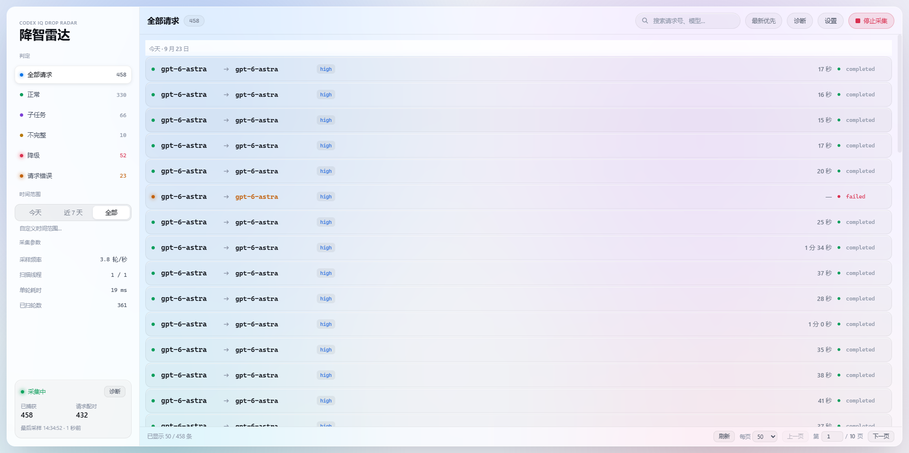
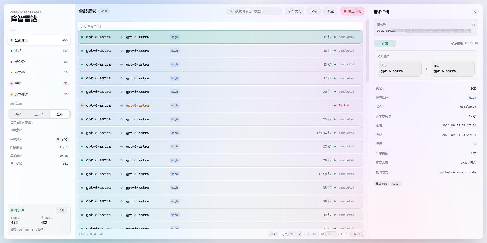
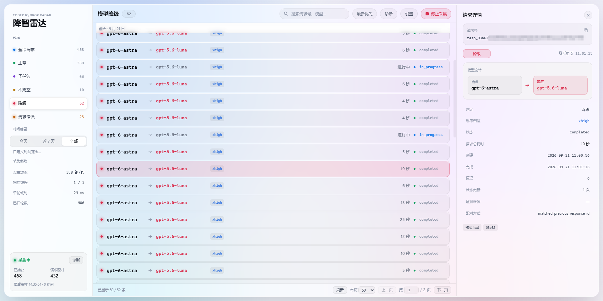
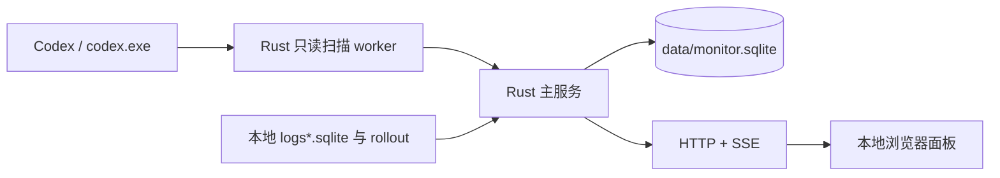

# CodexDowngradedMonitor · Codex 降智雷达

中文 · [English](docs/README.en.md)

> **仅供参考和学习，不具备实用价值。** 本项目只是一次短期的分析研究实验，用来记录和理解本机 Codex 进程中的可见字段；不应把它当作长期运行、稳定监控、生产告警或可靠审计手段。

这是一个观察本机 Codex 请求模型变化的本地工具。背景是：当请求模型和响应对象中的 `model` 不一致时，客户端通常很难留下可复核的本地记录；这个项目尝试把这类现象记录下来，放到一个本地 Web 面板里显示正常、子任务、降级和证据不足的请求。

这个项目是一次**纯 vibecoding 实验**：需求、实现、界面、调试和文档都在与 AI 协作的过程中完成，没有经过正式产品化、安全审计或第三方合规评估。它的定位是一次性分析研究，不是 Codex 的官方组件，也不是服务端审计工具。

相比于社区常用的“鹈鹕测试”，这个项目**不消耗任何 token**：它以只读旁路的方式在本机捕获降智的主要特征之一，不需要发起额外的测试请求；相比于搭代理抓包，它不介入网络链路、不修改任何流量，风险更小。但需要明确的是，它捕获的只是降智的**特征之一**，不代表所有降智都是相同的原理和作用机制——本项目只覆盖“请求模型与服务端实际使用的模型不一致”这一种情况，其余形式的降智不在它的观测范围内。




左侧是判定分类与采集参数，中间是请求列表，右侧是所选请求的证据详情。

| 正常请求 | 降级请求 |
| --- | --- |
|  |  |
| 请求模型与响应模型一致（`gpt-6-astra → gpt-6-astra`），判定为**正常**，证据来自响应 ID 前缀。 | 请求模型是 `gpt-6-astra`、响应模型是 `gpt-5.6-luna`，判定为**降级**，证据来自前序响应号。 |

截图来自本机的一次实际运行，其中的模型名与统计数字只反映当时的观测结果，不代表任何官方结论。

## 使用前必读

### 条款与责任

工具会读取其他程序的进程内存，以及 Codex 在本机生成的日志和会话文件。这类行为可能违反软件许可、服务条款或组织政策中的**逆向工程、数据提取、自动化访问和本地数据处理**规定，后果由使用者自行承担。不同地区、账户类型和软件版本适用的规则可能不同，请在使用前自行确认。

使用者应只在自己拥有或明确获准操作的设备、账户和工作区上运行，并自行承担由使用、分发、修改或公开本项目带来的法律、账户、数据和系统风险。作者不提供法律意见，也不保证本项目符合任何第三方条款。

### 它会做什么

- 读取 `codex.exe` 的可读内存，提取响应 ID、模型、状态、effort 和前序响应号等必要字段。
- 读取 Codex 本地 `logs*.sqlite`（常见文件名是 `logs_2.sqlite`）中的 item 关联信息。
- 读取 `~/.codex/sessions` 和 `archived_sessions` 下的 rollout JSONL，用 `token_usage_record` 补充请求模型和完成状态。
- 把判定结果、响应 ID、模型、状态和证据来源保存到本地 SQLite，并通过本地 HTTP/SSE 面板展示。

### 它不会做什么

- 不向外部服务上传内存、日志、rollout、对话正文或遥测数据。
- 不抓包、不代理网络、不修改 Codex 配置，不向目标进程写内存。
- 不注入 DLL、不创建远程线程、不 Hook，也不请求调试权限。
- 不把没有请求侧证据的记录直接判为“降级”；无法配对时会标为“证据不足”。

### 风险与兼容性

- **仅测试过 Windows**。实现依赖 Win32 的进程发现、`VirtualQueryEx` 和 `ReadProcessMemory`；macOS/Linux 当前不支持。
- 只监控一个 `codex.exe` 引擎进程；存在多个候选进程时按当前选择规则选取一个。
- Codex 的内存对象、日志表结构和 rollout 格式都属于内部实现，版本更新可能导致漏采、误判或旁路索引失效。
- 连续扫描会消耗 CPU 和内存带宽；对象生命周期很短，采样间隔过大时可能漏掉请求。
- 默认 HTTP 只监听 `localhost`。如果改成 `0.0.0.0`，接口没有身份认证，并且包含修改配置和停止服务的操作，只应在可信网络中使用。
- 工具观察到的是进程中的协议字段，不能证明服务端实际使用了哪套模型权重，也不能替代官方账单、审计或安全日志。

## 使用Release包

从 [Releases](https://github.com/mmdnaihuangbao/CodexDowngradedMonitor/releases) 下载最新发布包并解压。

- 双击 `start.bat` 启动。
- 双击 `stop.bat` 关闭。

从旧版本迁移时，先关闭旧版，再将 `config.json` 和 `data` 目录拷贝到新发布包中。

## 从源码构建

需要 Windows x64、Rust 1.92.0、VS2022 Desktop development with C++ 和 Windows SDK。工具链由 `rust-toolchain.toml` 固定，所有直接依赖使用精确版本，完整依赖图由 `Cargo.lock` 固定；构建与 CI 使用 `--locked`。

```powershell
.\src\tools\build.ps1 -Tests
.\src\tools\test.ps1 -PerformanceRuns 20
.\src\tools\package_release.ps1 -Version 0.5.0
.\out\run\start.bat
```

源码、Web、BAT 模板、测试和工具都在 `src/`；依赖缓存、构建、测试报告和发布产物都在忽略目录 `out/`。运行开发版时使用 `out/run`，不会把运行数据库写回源码目录。

发布工作流先执行 Rust 兼容测试与实际进程/HTTP 集成测试，再生成 ZIP。推送 `v*` 标签或手动执行发布工作流才会创建远端 Release；本地打包不会提交、打标签或推送。

## 配置

根目录的 `config.json` 保存默认设置：

| 字段 | 取值 | 作用 |
| --- | --- | --- |
| `host` | 主机名或 IPv4 地址 | 默认只监听 `localhost`；`0.0.0.0` 允许局域网访问 |
| `cpp_port` | `1`～`65535` | HTTP 服务起始端口 |
| `expect` | 字符串，可为空 | 预期模型，用于正常/子任务判定 |
| `min_interval_ms` | `0`～`60000` | 两轮扫描开始时间的最小间隔；`0` 表示连续扫描 |
| `workers` | `1`～`16` | Rust 扫描线程数，默认 `1` |

面板的“设置”可以修改 `expect`、`min_interval_ms` 和 `workers`，并写回配置文件。命令行参数只覆盖当次运行。需要降低资源占用时，增大 `--min-interval-ms`；需要减少短生命周期对象漏采时，可在机器允许的范围内提高 `--workers`。

## 面板和判定

服务由同一 EXE 的 Rust 主服务和扫描 worker 两种角色，以及现有浏览器页面组成：



请求模型证据有三条来源：

| 来源标记 | 关联方式 | 通常的到达时间 |
| --- | --- | --- |
| `memory_websocket` | 响应的 `previous_response_id` 对应请求对象 | 请求对象仍在内存中时 |
| `codex_log_prefix` | 日志里的响应 ID 与 output item ID 共享前缀 | 流式响应期间可能出现 |
| `rollout_token_usage` | `token_usage_record.response_id` → 回合模型 | 请求收尾并写入 rollout 后 |

只要请求模型和响应模型有可靠证据且两者不一致，才会产生降级告警。证据可能晚于响应到达，服务会在索引更新后重新判定已有记录。

| 判定 | 条件 | 告警 |
| --- | --- | --- |
| `normal` / 正常 | 请求模型与响应模型一致，并符合预期模型；或响应模型本身符合预期模型 | 否 |
| `subtask` / 子任务 | 请求模型与响应模型一致，但与预期模型不同；或未配对时命中 `effort=low` 启发式 | 否 |
| `downgrade` / 降级 | 请求模型与响应模型不一致，并且证据可追溯 | 是 |
| `incomplete` / 不完整 | 请求模型证据不足，无法断言发生降级 | 否 |

“请求错误”“进行中”“已取消”等属于响应自身的状态维度，面板会单独显示，不等同于判定结果。

## Web API

默认服务只绑定本机，接口如下：

| 方法 | 路径 | 说明 |
| --- | --- | --- |
| `GET` | `/api/health` | 检查服务是否在线 |
| `GET` | `/api/snapshot` | 获取当前状态、统计、告警和运行日志 |
| `GET` | `/api/responses` | 按判定、关键词和日期分页查询历史记录 |
| `GET` | `/api/stream` | SSE：首帧快照，后续推送增量更新和统计心跳 |
| `GET` | `/api/diagnose` | 回放最近一轮扫描诊断，不触发新扫描 |
| `POST` | `/api/config` | 更新 `expect`、`min_interval_ms`、`workers` |
| `POST` | `/api/clear` | 清空当前运行日志视图，保留 SQLite 历史记录 |
| `POST` | `/api/shutdown` | 停止采集器和 HTTP 服务 |

运行时数据写入 `data/monitor.sqlite`，启停诊断日志写入 `data/logs/collector.log`；两者默认都被 `.gitignore` 忽略。

## 项目结构与验证

| 路径 | 作用 |
| --- | --- |
| `src/app.rs`、`platform.rs`、`control.rs` | 命令模式、Win32 单例与独立控制管道 |
| `src/scanner.rs`、`extract.rs`、`worker.rs` | 只读扫描、字段解析和 Job Object 进程管理 |
| `src/monitor.rs`、`domain.rs` | 配对、判定、告警、完成态与延迟回补 |
| `src/storage.rs`、`config.rs`、`evidence.rs` | 兼容存储、原子配置、只读旁路证据 |
| `src/http.rs`、`src/Web/` | HTTP/SSE 与浏览器面板 |
| `src/tests/`、`src/tools/`、`src/launchers/` | 固定样例、测试、构建打包与 BAT 模板 |

测试包含 v0.4 的 180 组判定对照、JSON 指纹、原始 schema 和游标兼容、写库失败回滚、3105 条历史回补、只读 WAL、跨块扫描、worker 崩溃、跨目录单例、实际 HTTP/SSE 与整目录升级。

```powershell
$env:CARGO_HOME = Join-Path $PWD 'out/cargo'
cargo test --locked
cargo fmt --all --check
cargo clippy --locked --all-targets --all-features -- -D warnings
```

`readonly_child` 是由只读 WAL 测试主动启动的子进程测试助手；默认列表显示 ignored，它的断言由父测试执行并检查退出码。

## 模型说明

本项目是一次多模型协作的 vibecoding 实验，各部分大致由以下模型完成：

| 工作内容 | 模型 |
| --- | --- |
| 调研、前端、最小实现、请求模型匹配优化 | DeepSeek V4.1 Flash |
| 前端设计 | Hy4 preview（WorkBuddy） |
| 优化、文档、GitHub Actions、Rust 重构 | GPT 6 Astra |
| 摆烂（请求模型匹配优化） | GPT 5.6 Sol |
| 文档、版本管理 | GLM 5.3 Flash |

各模型的实际命名以对话当时各自服务端的返回为准——毕竟这正是本项目要监控的东西。

<sub>摆烂备注：请求模型匹配优化这活，GPT 5.6 Sol 调查了半小时后表示搞不成，提供了完整思路还是搞不成；同一思路 DeepSeek V4.1 Flash 十分钟干完了。</sub>

## 许可证

本项目基于 [MIT License](LICENSE) 发布。MIT 只授予版权与许可声明中的权利，不代表本项目符合任何第三方服务条款；使用前请先阅读[条款与责任](#条款与责任)一节。
