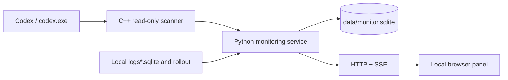

# CodexDowngradedMonitor · Codex Downgrade Radar

[中文](../README.md) · English

> **For reference and learning only; not of practical value.** This project is a short-term analysis research experiment for recording and understanding the fields visible in the local Codex process. Do not treat it as a long-running, stable monitoring solution, a production alerting system, or a reliable auditing tool.

This is a local tool for observing request-model changes in the local Codex client. The background: when the requested model and the `model` in the response object differ, the client usually leaves no reviewable local record. This project tries to record such occurrences and display them in a local web panel, showing requests as normal, subtask, downgraded, or insufficient evidence.

This project is a **pure vibecoding experiment**: requirements, implementation, UI, debugging, and documentation were all produced in collaboration with AI, without formal productization, security audits, or third-party compliance assessments. It is positioned as one-off analysis research — not an official Codex component, and not a server-side auditing tool.

Compared with the community-favorite "pelican test", this project **consumes zero tokens**: it captures one of the primary signatures of downgrades locally via a read-only side channel, without sending any extra test requests. Compared with setting up a proxy to capture traffic, it stays off the network path and modifies no traffic, so the risk is lower. To be clear, it captures only **one signature** of downgrades; it does not imply all downgrades share the same principle or mechanism — this project only covers the "requested model differs from the model actually served" case. Other forms of downgrading are outside its observation scope.

## Read Before Publishing / Using

### Terms and Responsibility

The tool reads other programs' process memory as well as logs and session files that Codex generates locally. Such behavior may violate **reverse-engineering, data-extraction, automated-access, and local-data-processing** clauses in software licenses, terms of service, or organizational policies; the consequences are borne by the user. Different regions, account types, and software versions may be subject to different rules — verify them yourself before use.

Users should only run it on devices, accounts, and workspaces they own or are explicitly authorized to operate, and bear the legal, account, data, and system risks of using, distributing, modifying, or publishing this project themselves. The author provides no legal advice and does not guarantee this project complies with any third-party terms.

### What It Does

- Reads the readable memory of `codex.exe` to extract essential fields such as response ID, model, status, effort, and previous response ID.
- Reads item association info from Codex's local `logs*.sqlite` (commonly `logs_2.sqlite`).
- Reads rollout JSONL under `~/.codex/sessions` and `archived_sessions`, using `token_usage_record` to supplement the request model and completion status.
- Saves verdicts, response IDs, models, statuses, and evidence sources to a local SQLite database, and displays them through a local HTTP/SSE panel.

### What It Does Not Do

- Does not upload memory, logs, rollouts, conversation content, or telemetry to any external service.
- Does not capture packets, proxy network traffic, or modify Codex configuration; does not write to the target process's memory.
- Does not inject DLLs, create remote threads, hook, or request debugging privileges.
- Does not mark records lacking request-side evidence as "downgraded"; unmatched records are labeled "insufficient evidence".

### Risks and Compatibility

- **Tested on Windows only.** The implementation relies on Win32 process discovery, `VirtualQueryEx`, and `ReadProcessMemory`; macOS/Linux are currently unsupported.
- Requires Python 3.8+. The first run requires building the native collector with the Visual Studio 2022 C++ workload.
- Monitors a single `codex.exe` engine process; when multiple candidate processes exist, one is chosen per the current selection rules.
- Codex's in-memory objects, log table structure, and rollout format are internal implementation details; version updates may cause missed captures, misjudgments, or broken side-channel indexes.
- Continuous scanning consumes CPU and memory bandwidth; object lifetimes are short, and overly long sampling intervals may miss requests.
- By default the HTTP server listens on `localhost` only. If changed to `0.0.0.0`, the endpoints have no authentication and include operations that modify configuration and stop the service — use only on trusted networks.
- The tool observes protocol fields in the process; it cannot prove which model weights the server actually used, nor replace official billing, auditing, or security logs.

## GitHub Release Package (No C++ Build Needed)

GitHub Releases provide a minimal runtime package like `CodexDowngradedMonitor-v0.3.0-windows-amd64.zip`. The archive already contains `cpp_collector\build\collector_native.exe`, so users do not need Visual Studio or a C++ rebuild; only Windows, Python 3.8+, and a local Codex are required.

1. Download the `windows-amd64.zip` from the GitHub Releases page.
2. Extract the whole archive to any directory, keeping the relative layout of `cpp_collector`, `web`, and root files.
3. Double-click `start.bat`, or run `python .\start.py`.
4. Open `http://localhost:48778/` in a browser; to stop, run `python .\start.py --stop`.

The `README.md` at the archive root is the user-facing no-build guide; see the in-repo [release package guide](docs/RELEASE_USAGE.md). The default `config.json` inside the package comes directly from the repository state of the branch/revision selected when the Release was created.

### Creating a Release Manually

The repository ships with the [`Build and publish Windows release`](../.github/workflows/release.yml) workflow:

1. Open **Actions** in the GitHub repository, select the workflow, and click **Run workflow**.
2. Choose the branch or commit to publish.
3. Enter the version (e.g. `0.3.0` or `v0.3.0`) and the change summary; optionally mark it as a prerelease.
4. The workflow runs Python tests, builds the C++ collector, generates the minimal archive on a Windows amd64 runner, and creates the corresponding GitHub Release.

Pushing a `v*` tag also triggers this workflow automatically. The version number becomes a `v`-prefixed Git tag. The release package uses the source code and `config.json` from the selected revision — never local databases, logs, or other runtime files from the build machine.

## Deploy and Run from Source

### Requirements

- Windows, with Codex installed and running locally so that `codex.exe` exists.
- Python 3.8 or newer, with `python` on `PATH`.
- Visual Studio 2022 **Desktop development with C++** workload and the Windows SDK.
- The Python part uses only the standard library; no third-party packages needed.

### 1. Get the Code and Build the C++ Collector

```powershell
git clone <repository-url>
cd CodexDowngradedMonitor

powershell -NoProfile -ExecutionPolicy Bypass `
  -File .\cpp_collector\build.ps1
```

The build output is `cpp_collector\build\collector_native.exe`. That directory is ignored by `.gitignore`, so a fresh environment must build once first; the repository does not commit prebuilt binaries.

### 2. Start

```powershell
python .\start.py
```

The launcher runs the collection service in the background and opens `http://localhost:48778/` automatically. You can also double-click the root `start.bat`. When Codex is not yet running, the panel shows "codex.exe not found"; once Codex starts, the collector reconnects automatically.

Common commands:

```powershell
python .\start.py --status                         # Show run status
python .\start.py --stop                           # Stop the service
python .\start.py --no-open                        # Start without opening the browser
python .\start.py --fg                             # Run in foreground, Ctrl+C to stop
python .\start.py --expect gpt-6-astra             # Set the expected model
python .\start.py --workers 8 --min-interval-ms 100
```

`start-cpp.bat` is a compatibility entry for `start.bat`, and `stop-cpp.bat` passes `--stop` to the launcher. When the default port is taken, the service automatically tries subsequent ports and prints the actual address at startup.

## Configuration

The root `config.json` stores default settings:

```json
{
  "version": "0.1",
  "host": "localhost",
  "cpp_port": 48778,
  "expect": "",
  "min_interval_ms": 250,
  "workers": 1
}
```

| Field | Values | Purpose |
| --- | --- | --- |
| `host` | hostname or IPv4 address | Defaults to `localhost` only; `0.0.0.0` allows LAN access |
| `cpp_port` | `1`–`65535` | Starting port for the HTTP service |
| `expect` | string, may be empty | Expected model, used for normal/subtask verdicts |
| `min_interval_ms` | `0`–`60000` | Minimum interval between the start times of two scan rounds; `0` means continuous scanning |
| `workers` | `1`–`16` | Number of C++ scan threads, default `4` |

The panel's "Settings" can modify `expect`, `min_interval_ms`, and `workers`, writing them back to the config file. Command-line arguments override the current run only. To reduce resource usage, increase `--min-interval-ms`; to reduce missed captures of short-lived objects, raise `--workers` within what your machine allows.

## Panel and Verdicts

The service consists of one Python process, one resident C++ helper process, and the browser page:



Request-model evidence comes from three sources:

| Source tag | Association | Typical arrival time |
| --- | --- | --- |
| `memory_websocket` | The response's `previous_response_id` matches a request object | While the request object is still in memory |
| `codex_log_prefix` | The response ID and output item ID in logs share a prefix | May appear during streaming responses |
| `rollout_token_usage` | `token_usage_record.response_id` → turn model | After the request finishes and is written to rollout |

A downgrade alert is raised only when both the request model and the response model have reliable evidence and they disagree. Evidence may arrive later than the response; the service re-evaluates existing records after index updates.

| Verdict | Condition | Alert |
| --- | --- | --- |
| `normal` | Request model matches response model and matches the expected model; or the response model itself matches the expected model | No |
| `subtask` | Request model matches response model but differs from the expected model; or an unmatched record hits the `effort=low` heuristic | No |
| `downgrade` | Request model and response model disagree, with traceable evidence | Yes |
| `incomplete` | Insufficient request-model evidence to assert a downgrade | No |

"Request error", "in progress", "cancelled" and the like belong to the response's own status dimension; the panel displays them separately, and they are not equivalent to verdicts.

## Web API

By default the service binds to localhost only. Endpoints:

| Method | Path | Description |
| --- | --- | --- |
| `GET` | `/api/health` | Check whether the service is online |
| `GET` | `/api/snapshot` | Get current status, statistics, alerts, and run log |
| `GET` | `/api/responses` | Paged history query by verdict, keyword, and date |
| `GET` | `/api/stream` | SSE: first frame is a snapshot, then incremental updates and statistics heartbeats |
| `GET` | `/api/diagnose` | Replay the diagnostics of the last scan round without triggering a new one |
| `POST` | `/api/config` | Update `expect`, `min_interval_ms`, `workers` |
| `POST` | `/api/clear` | Clear the current run-log view, keeping the SQLite history |
| `POST` | `/api/shutdown` | Stop the collector and the HTTP service |

```powershell
Invoke-RestMethod http://localhost:48778/api/snapshot
```

Runtime data is written to `data/monitor.sqlite`, logs to `collector.log`; both are ignored by `.gitignore` by default.

## Project Layout

| Path | Purpose |
| --- | --- |
| `start.py` | Unified entry for starting, checking status, and stopping the service |
| `collector.py` | Verdicts, alerts, persistence, and the HTTP/SSE service |
| `native_scanner.py` | JSON adapter between Python and the C++ helper process |
| `process_discovery.py` | Finds `codex.exe` using Win32 APIs |
| `evidence_index.py` | Read-only indexing of Codex logs and rollouts |
| `history_store.py` | SQLite history store, paged queries, and event records |
| `cpp_collector/` | C++ memory scanning, prefiltering, field parsing, and native tests |
| `web/` | HTML, CSS, and JavaScript of the browser panel |
| `.github/workflows/release.yml` | Windows amd64 build and GitHub Release workflow (tag push / manual) |
| `tools/package_release.ps1` | Collects runtime files, writes release notes, and produces the minimal archive |
| `docs/RELEASE_USAGE.md` | The no-build usage guide placed at the release archive root |

Further reading:

- [C++ collector notes](../cpp_collector/README.md): read-only boundaries, performance implementation, and native tests.
- [History store notes](../HISTORY.md): SQLite table structure, migrations, and compatibility behavior.
- [Field survey](../FIELD_SURVEY.md): protocol fields actually observed and survey boundaries.
- [Request-model source survey](../cpp_collector/REQUEST_MODEL_SOURCES.md): sources and limitations of `rollout` and `logs*.sqlite` evidence.

## Development and Verification

After building the C++ collector, you can run:

```powershell
python -m unittest discover -s tests -p "test_*.py" -v
python .\_selftest.py
powershell -NoProfile -ExecutionPolicy Bypass `
  -File .\cpp_collector\tests\run.ps1
```

`_selftest.py` starts a temporary service and checks static assets, snapshots, SSE, configuration, log clearing, port fallback, and the shutdown endpoint; the C++ tests cover cross-chunk objects, long fields, adjacent-object isolation, request pairing, read-only process reading, and the helper process lifecycle.

## Models

This project is a multi-model collaborative vibecoding experiment; roughly, the parts below were completed by the following models:

| Work | Model |
| --- | --- |
| Research, frontend, minimal implementation, request-model matching optimization | DeepSeek V4.1 Flash |
| Frontend design | Hy4 preview (WorkBuddy) |
| Optimization, docs, GitHub Actions | GPT 6 Astra |
| Gave up (request-model matching optimization) | GPT 5.6 Sol |
| Docs, version management | GLM 5.3 Flash |

The actual names of the models are whatever their servers returned at conversation time — which is, after all, exactly what this project monitors.

<sub>A note on "gave up": for the request-model matching optimization, GPT 5.6 Sol investigated for half an hour and concluded it couldn't be done — even with a complete approach handed over, it still couldn't. DeepSeek V4.1 Flash finished the same approach in ten minutes.</sub>

## License

This project is released under the [MIT License](../LICENSE). MIT only grants the rights stated in the copyright and license notice; it does not mean this project complies with any third-party terms of service. Please read the [Terms and Responsibility](#terms-and-responsibility) section first.
